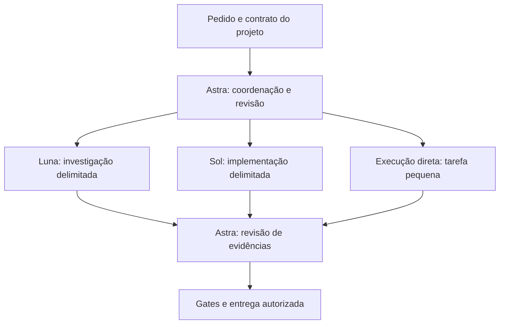

# Arquitetura

O kit distribui arquivos de configuração e instruções; o Codex executa os agentes.
Não há scheduler, daemon, API intermediária ou runtime próprio. O instalador usa
Python 3.11+ e biblioteca padrão para preparar arquivos locais sem chamar modelos.
O contrato da entrega está na [SPEC](SPEC.md).

## Papéis e fronteiras

| Papel | Modelo padrão | Esforço | Responsabilidade |
| --- | --- | --- | --- |
| Coordenador | `gpt-6-astra` | `low` | Delimitar problema, decidir, integrar e revisar |
| Executor | `gpt-6-sol` | `medium` | Implementar e depurar nos arquivos atribuídos |
| Investigador | `gpt-6-luna` | `high` | Ler código, rastrear fluxo e devolver evidências |

Essa distribuição é uma hipótese operacional, não um ranking universal. IDs podem
ser substituídos no instalador; sua aceitação local não comprova disponibilidade
na conta. A tarefa pequena permanece com o agente atual: delegar também custa
leitura, instrução, espera e revisão. O [piloto](EVALUATION.md) mede esse problema.

O limite nativo de concorrência é de dois filhos, além do coordenador. A política
proíbe delegação recursiva, prefere contexto novo e admite uma tentativa de
correção antes de reavaliar o pacote. Essas três regras são instruções ao modelo,
não garantias equivalentes ao limite de threads. Quando a interface expõe
`fork_turns`, pedir `none` evita herdar toda a conversa; em outra interface,
verifique o mecanismo disponível e registre a limitação. A documentação oficial
explica os [subagentes e sua configuração](https://learn.chatgpt.com/docs/agent-configuration/subagents).

Luna recebe responsabilidade somente de leitura. Uma instrução comportamental
não substitui permissões efetivas; confira o sandbox resolvido pela interface.
Workers compartilham arquivos: separar ownership é necessário mesmo com contextos
independentes. O coordenador revisa mudanças antes de aceitá-las.

## Escopo da instalação

`orchestration.config.toml` contém campos de configuração na raiz; os arquivos em
`agents/` definem os papéis e um bloco delimitado em `AGENTS.md` define a política.
A versão de referência suportada é **Codex CLI 0.157.1**. Nela,
`codex -p orchestration` carrega diretamente `$CODEX_HOME/orchestration.config.toml`
como camada sobre a configuração base, conforme confirmado por
`codex exec --help`. Não é necessário mesclar arquivos nem usar a tabela legada
`[profiles.orchestration]`. Clientes anteriores não são suportados pelo kit;
novas versões precisam preservar esse contrato. Veja o [README](../README.md).

**Opt-in do perfil não significa isolamento de todas as instruções.** Os papéis e
`AGENTS.md` instalados pertencem ao `CODEX_HOME` escolhido e podem afetar sessões
que não selecionam esse perfil. Use um home dedicado quando precisar separar
experimentos. A precedência de configurações e as chaves suportadas são definidas
pelo Codex em [Config basics](https://learn.chatgpt.com/docs/config-file/config-basic)
e [Config reference](https://learn.chatgpt.com/docs/config-file/config-reference).

O instalador não deve sobrescrever `config.toml`, autenticação, sessões, regras
ou plugins. Prévia sem `--apply`, backup privado e restauração com verificação de
hash reduzem o risco de perder configuração. Alteração posterior divergente deve
bloquear restauração automática. `doctor` verifica consistência local; não prova
que o modelo executa, que a conta tem acesso ou que o fluxo de entrega funciona.
